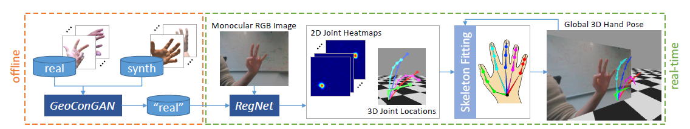
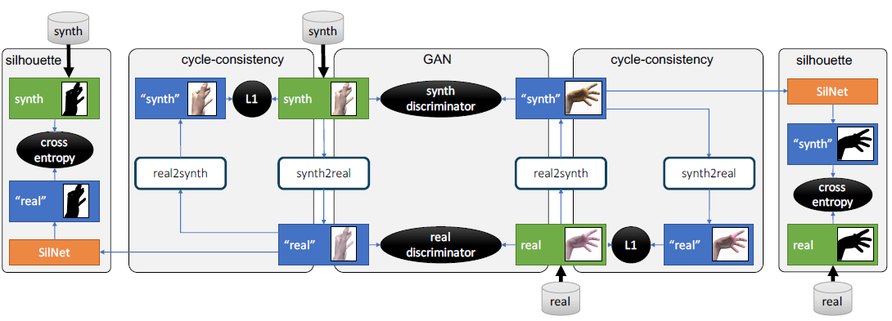
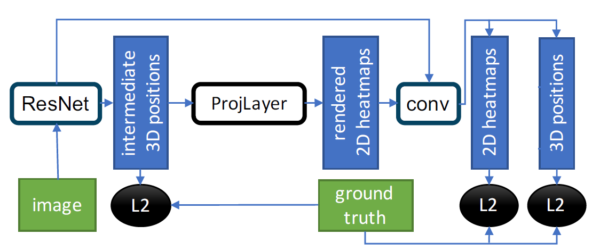

# Ganerated Hands For Real Time in Keras

original paper site: https://handtracker.mpi-inf.mpg.de/projects/GANeratedHands/

I'm not original member.

I just re-implemented using keras.

## (To Do)
- Refactoring the code how to training each model.

---

Using monocular RGB camera track 3D hand pose.

It is consist with __GeoConGAN__(offline), __RegNet and fitting function__(online). 

  


## GeoConGAN
Using GeoConGAN for Data Augmentation. It is based on CycleGAN.

Just using CycleGAN made undesirable result. So using geometrical consistent loss for keep hand shape.  




#### No Geometric loss result (To do)
#### Geometric loss result (To do)


## RegNet  
It`s input is 256x256 image and output is 2D Renderd heat map and 3D positions

It is based on ResNet. Origin author use ProjLayer to give relevance each other. 
 ProjLayer make 3D position to 2D Rendered Heatmap.  

In my code, I split it to ProjLayer, RenderingLayer. ProjLayer change 3D position to 2D position.  

And RenderingLayer change 2D position to Heat map



## Getting Started

These instructions will get you a copy of the project up and running on your local machine for development and testing purposes. See deployment for notes on how to deploy the project on a live system.

### Requirement 

- Tensorflow 1.12
- keras 2.2.4  
- numpy 1.16.2  
- pillow 6.0
- opencv 3.4
    
### How to use

1. Clone into your local directory.  
    ```
    C:\user\local> git clone https://github.com/Ninebell/GaneratedHandsForReal_TIME
    ```
2. Move to project folder
    ```
    C:\user\local> cd GaneratedHandsForReal_TIME
    ```
3. You can run command (To do)
    ```
    C:\user\local> python test_regnet.py command
    ```
    
    Command List
    - train --i data_path  
    - test --i image_data_set_path 
    - test --v video_file_path
    
    ex)
    ```
    C:\user\local> python test_regnet.py train --i data_path
    ```
## Data Set
- SynthData: https://handtracker.mpi-inf.mpg.de/projects/OccludedHands/SynthHands.htm
- RealData: https://handtracker.mpi-inf.mpg.de/projects/GANeratedHands/GANeratedDataset.htm

## License

This project is licensed under the MIT License - see the [LICENSE](LICENSE) file for details

