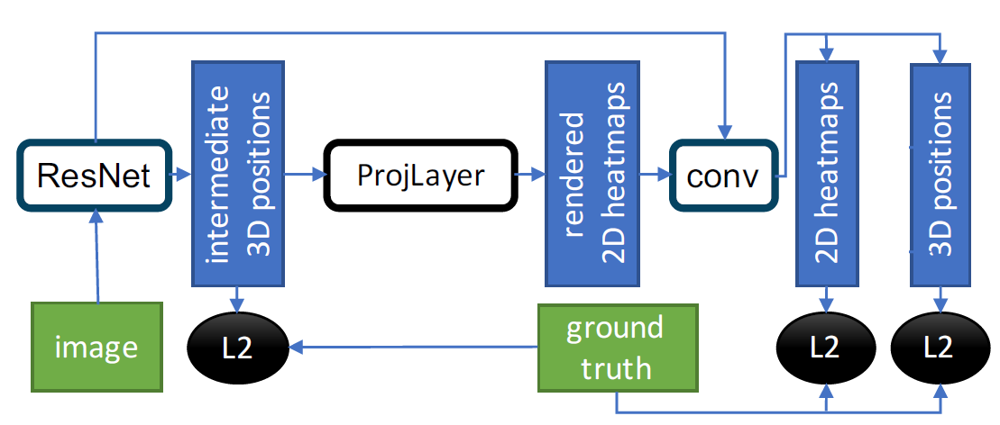

# RegNet 
### What is main idea of RegNet?
My opinion is ProjLayer. It can connect 2D Rendered map and 3D position.
So this can make up for each deficiency.  

In 3D, they can not exactly detect the position. In 2D, the can not know hand's depth.
3D can know hand's depth, 2D know where they are in image.   



### What is problem?
- RegNet can not detect multi hands.
    - I don't know how to solve to this problem. But more study about deep learning and pose estimation.  
    **I WILL SOLVE**.
    - Will study OpenPose.

## Problems encountered When I work
- How to implement ProjLayer in keras?
    - Just broadcast all points to make gaussian heat-map.

- Not module found
    -  How to solve   
        ```
        C:\users\local> set PYTHONPATH='YOUR clone path'
        ```
- Data set wrong split  
    > Prev code was split the data set on every time. it caused a problem which mixed train and test set.  
    - Now I add path list for keeping the data list. when you train, you don't need to pass the --data argument
    
    
## How to use
- How to train?
    ```shell script
    C:\users\local\RegNet> python regnet_main.py --data YOUR_DATA_PATH
    ```
    >Data path must same with GANerated_Dataset. I recommend you to use original Data Set.  
     If you don't pass Data path, program will use prev data list.                                                                                                                    

    - if you have pretrained model
    ```shell script
    C:\users\localRegNet> python regnet_main.py --data YOUR_DATA_PATH --model YOUR_MODEL_PATH
    ```
## Some issue  
- How to change Heatmap size?  
    In regnet_main.py line 44
    ```python
      heatmap_shape = (32,32)
    ```
    Change what you want. __BUT YOU NEED TO CHANGE THE REGNET MODEL SHAPE__.  
    because You can see the concatenate layer with renderingLayer(projlayer) and conv layer.  
    In regnet.py line 121
    ```python
    120  conv_rendered_3 = Conv2D(filters=128, kernel_size=3, strides=2, padding='same', activation='relu')(conv_rendered_2)
    121  concat_pred_rendered = concatenate([conv, conv_rendered_3])
    122  conv_rendered_4 = Conv2D(filters=256, kernel_size=3, strides=1, padding='same', activation='relu')(concat_pred_rendered)
    ```
    So you match the shape of conv layer to shape what you want.

